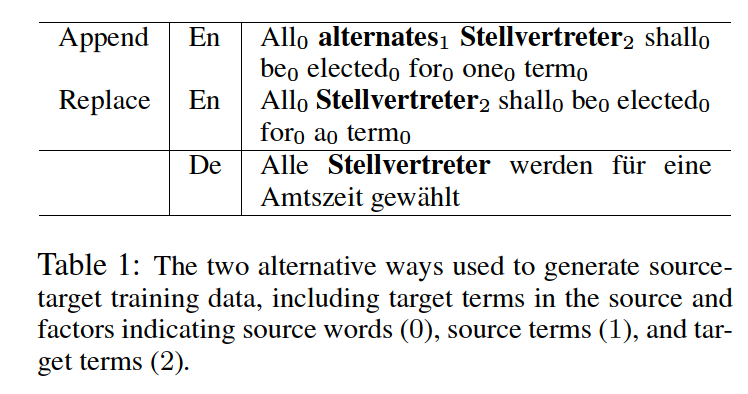

# Constrained Text Generation

## Lexicallly Constrained Decoding

>I assume most people are familiar with the GBS and DBA algorithms below.

&#x1F4D8; **Lexically Constrained Decoding for Sequence Generation Using Grid Beam Search, ACL2017**

&#x1F4D8; **Fast Lexically Constrained Decoding with Dynamic Beam Allocation for Neural Machine Translation, NAACL2018**

## Finite-state Machine Based Decoing

&#x1F4D8; **Guided Open Vocabulary Image Captioning with Constrained Beam Search, EMNLP2017**

+ Problem
  + image captioning models do not generalize well to out-of-domain images containing novel scenes or objects.
+ Solution
  + finte-state machine based beam search

&#x1F4D8; **Neural Machine Translation Decoding with Terminology Constraints, NAACL2018**

+ Problem
  + Integrating user-provided terminology constraints to translation results
+ Solution
  + Bring the Finite-state Machine Based Decoing to NMT
    + Take phrase constraints into consideration instead of separate words only.
    + Multi-Stack Decoding: maintain a beam for each state.
    + Decoding with Attention: the transition condition is change to whether the model attends to an interval around the corresponding source terminology. 

## Backward and Forward Language Modeling

&#x1F4D8; **Backward and Forward Language Modeling for Constrained Sentence Generation, arXiv2015**

+ Problem
  + Impose hard constraints to the generated text on the LM task.
+ Solution
  + B/F Language Model
    + syn-B/F 
    + asyn-B/F 

&#x1F4D8; **BFGAN: Backward and Forward Generative Adversarial Networks for Lexically Constrained Sentence Generation, TASLP2019**

+ Problem
  + Mou et al., 2015 tends to generate semantically inconsistent or incoherent sentences
+ Solution
  + Propose a BFGAN model, which has a backward generator, a forward generator, and a discriminator.

&#x1F4D8; **Correct-and-Memorize: Learning to Translate from Interactive Revisions, IJCAI2019**

*(see the notes of this paper in the survey of CAT)*

## Data Augmentation Based Constrained Generation

> The three works below are trying to integrate bilingual terminologies through data augmentation.

&#x1F4D8; **Code-Switching for Enhancing NMT with Pre-Specified Translation, NAACL2019**

+ Solution
  + Replace the source terminology with its translation and use a pointer net to learn the copy mechanism.

&#x1F4D8; **Training Neural Machine Translation to Apply Terminology Constraints, ACL2019**

+ Solution
  + This paper propose two kinds data augmentation strategies, one is replacing and the other is appending. It uses three types of embedding to make the NMT model can distinguish different kinds of words in the source side.

&#x1F4D8; **Merging External Bilingual Pairs into Neural Machine Translation, arXiv2019**

+ Solution
  + This paper propose three kinds of tagging methods:
    + "我 爱 \<start> 香港 \<end>  |||  i love \<start> hong kong \<end>"
    + "我 爱 \<start> 香港 \<middle> hong kong \<end>  |||  i love \<start> hong kong \<end>"
    + Add different types of emebdding on previous two methods.

## Other Works

&#x1F4D8; **CGMH: Constrained Sentence Generation by Metropolis-Hastings Sampling, AAAI2019**

+ Solution
  + Using M-H sampling to sample instances from the distribution that some specific keywords are in the language.

