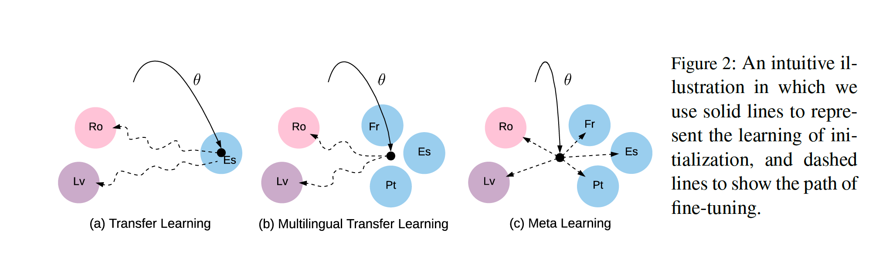
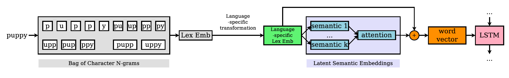

## Low-Resource NMT

&#x1F4D8; **When and Why are Pre-trained Word Embeddings Useful for Neural Machine Translation?**

This paper empirically evaluates the effects of pre-trained word embeddings in the low-resource NMT scenario. The experiments' results is concluded as follows:

1. Pret-trained word embeddings in the source and target languages help to increase the BLEU to some degree. The gains achieved by source pre-trained embeddings are much more significant than those of target pre-trained embeddings.
2. The BLEU gain is highest when the NMT model is poor but not too poor (~ 3 or 4 BLEU score)
3. It demonstrates that the more similar the source and target languages are, the more gains can be achieved by pre-trained embeddings. However, I am suspicious of this finding's reliability. I suspect that this may be caused by the complexity of the language itself.
4. This paper also finds that algining the source embedding and the target embedding to the same space doesn't improve the translation quality of low-resource NMT
5. However, when pre-trained on the HRL pair, algining the source and target embedding helps to improve the performance of NMT model.

### Low-Resource NMT in The Multilingual Fashion

&#x1F4D8; **Universal Neural Machine Translation for Extremely Low Resource Languages**

This paper propose a method to share the lexical and sentence level representations across multiple source languages into one target languages. Concretely, it firstly maps all the specific monolingual lexicons to the universal representations (En in this paper), and then uses several expert netwoeks to learn a universal sentence level representations.

&#x1F4D8; **Meta-Learning for Low-Resource Neural Machine Translation**

The novelty of this paper is not enough, but it is the early work of adressing the low-resource NMT problem in the meta-learning fashion. There are two categories of meta-learning:

1. learning a meta-policy for updating model parameters
2. learning a good parameter initialization for fast adaptation

And this paper is in the second fashion.

The differences among transfer learning, multilingual transfer learning and meta learning are shown in the figure below:

&#x1F4D8; **Rapid Adaptation of Neural Machine Translation to New Languages**

The writing of this paper is pretty good. It firstly propose three multilingual training paradigms: 1) single-source; 2) Bi-source; 3) All-source and two finetuning based adaptation method: 1) seed model variety; 2) warm and cold start.

This paper also propose a Similar-Language Regularization (SLR) method, which is used to adress the problem that adapting to a small amount of data in the target language will be very easy for the model to over-fit to the small training set. Thus this paper propose two concretely SLR method. One (Corpus Concatenation) is concatenate the data of a similar HRL. The other one (Balanced Sampling) is mix the HRL and the LRL in a minibatch with a specific ratio.

&#x1F4D8; **Multilingual Neural Machine Translation With Soft Decoupled Encoding**

This paper proposes a Soft Decoupled Encoding (SDE) framework to learn the word representations of low-resource languages without requiring pre-segmenting the data. This paper firstly discusses the advantages and disadvantages of different pre-segmenting strategy with different granularity:

+ word level: In the scenario of multilingual low-resource, the OOV problem becomes much heavier.
+ subword level: The subwords from high-resource languages might dominate the vocabulary, thus the subwords of low-resource languages may be split into extremely small pieces.
+ character level: This method puts a large amount of pressure on NMT models, requiring model sizes and training data.

However, I don't kown the drawback of subwords in this scenario is severe or not, there is no experiments or evidence to prove this hypothesis. Then this paper describes its SDE framework, which decomposes the word representations by a lexical embedding and a latent semantic embedding. The lexical embedding is generated by sum all the embeddings of the word n-grams, and the latent semantic embedding is got by attention mechanism (lexical embedding as query, semantic matrix as key and value). The framework is shown as below:

&#x1F4D8; **Massively Multilingual Neural Machine Translation**

This paper trains a multilingual many-to-many NMT model with up to 58 languages to-and-from English. The model architecture is the base Transfromer model. Just by training on more languages, the NMT model has outperformed the state-of-the-art results.

There are some insightful observations:

1. many-to-many NMT model outperforms many-to-one NMT model on  X-En tasks. The reason is that many-to-one NMT model would overfit due to the scarce EN data (proved by experiments).
2. many-to-one NMT model outperforms many-to-many NMT model on EN-X tasks. This may be casued by that most of the target languages during training are english (half of the data is X-EN), which would leave less capacity for the other languages.

&#x1F4D8; **Addressing Word-order Divergence in Multilingual Neural Machine Translation for Extremely Low Resource Languages**

&#x1F4A1; **keywords**: low-resource&nbsp;&nbsp;&nbsp;&nbsp;transfer learning&nbsp;&nbsp;&nbsp;&nbsp;pre-order

In the context of transfer learning, this paper propses a method to address the word order divergence problem between the source language and the assisting language. That is, using some parallel corpora between SVO (e.g., English) languages and SOV languages (e.g., Indian) to help the the translation between SOV and SOV languages (e.g. xxx->Indian), where the parallel data between SOV and SOV languages may be limited. This paper proposes to adress this word order divergence problem by pre-ordering the assisting language (SVO) to match the source language (SOV). Then the SOV->SOV model will be fine-tuned based on the model trained on reordered SVO-SOV dataset.

&#x1F4D8; **Effective Cross-lingual Transfer of Neural Machine Translation Models without Shared Vocabularies**

Thus they propose a method to transfer the NMT model without shared vocabulary. This paper points out a drawback of the multilingual NMT model with shared vocabulary, where the multilingual NMT model have to re-train with new vocabluary when adopting a new language. Thus they they propose a method to adress this problem as follows:

1. Learn monolingual embedding of the child language
2. Extract source embedding from a pre-trained parent NMT model
3. Learn a cross-lingual linear mapping between 1 and 2 by minimizing the euclidean distance between the transformed children embedding and the parent embedding.
4. Replace source embedding of the parent model parameters with the learned crosslingual embedding.
5. Initialize the child model with 4 and start the
NMT training on the child language pair.

The dictionary used in step 3 is induced by a unsupervised method.

There are some tricks used in the paper:

1. It considers the word order divergence problem and adrees it by randomly shuffle part of the source sentence.
2. It uses some synthetic data to boost the training, where the synthetic data is generated by changing the words out of the overlap set of the parent and children vocabulary to unk.

&#x1F4D8; **Target Conditioned Sampling: Optimizing Data Selection for Multilingual Neural Machine Translation**

This paper want to design a data selection strategy to choose the most relevant multilingual data to boost the performance and training speed of low-resource language. This paper propose two methods to evaluate the choosen data, the one uses the vocab overlap and the other uses a language model to score the sentence.

&#x1F4D8; **Optimizing Data Usage via Differentiable Rewards**

This paper proposes a RL algorithm to dynamicly score the data. This paper is rejected by ICLR and its author is the same as the Target Conditioned Sampling one.

&#x1F4D8; **Exploiting Multilingualism through Multistage Fine-Tuning for Low-Resource Neural Machine Translation**

&#x1F4A1; **keywords**: low-resource

This paper argues that translating from a low-resource langue to EN is much easier thant the other direction, because of the parallel data between EN and other languages and the monolingual dataset of EN. Thus it propsoe a fine-tuning strategy to improve the quality of EN->low-resource translation.

### Low-Resource NMT in The Monolingual Fashion

&#x1F4D8; **Bi-Directional Differentiable Input Reconstruction for Low-Resource Neural Machine Translation**

&#x1F4A1; **keywords**: low-resource&nbsp;&nbsp;&nbsp;&nbsp;back-translation&nbsp;&nbsp;&nbsp;gumble

This paper aims to improve the perforamce of low-resource NMT by adding a term of differentiable input reconstruction loss to the training objective. Since the original back-translation is indifferentiable, they use Straight-Through Gumbel Softmax (STGS) estimator to tackle this problem.

&#x1F4D8; **Neural Machine Translation of Low-Resource and Similar Languages with Backtranslation**

&#x1F4A1; **keywords**: low-resource&nbsp;&nbsp;&nbsp;&nbsp;back-translation

This paper uses back-translation to improve the performance of translation systems built upon similar low-resource languages.

&#x1F4D8; **Generalized Data Augmentation for Low-Resource Translation**

&#x1F4A1; **keywords**: low-resource&nbsp;&nbsp;&nbsp;&nbsp;back-translation

This paper proposes a generalized data augmentation framework for low-resource NMT. The senario of this paper is translating from a low-resource language (LRL) to English, where a high-resource language (HRL) related to LRL is avaliable. Specifically, we have two parallel datasets, ENG-HRL and ENG-LRL and a monolingual dataset ENG. The order of the three datasets is: ENG > ENG-HRL > ENG-LRL. To train a LRL->ENG model, the traditional data augmentation method is to back-translate the ENG dataset to LRL using a ENG->LRL model and then learn the LRL->ENG model based on the synthetic LRL-ENG data and the avaliable LRL-ENG data. 

However, this method suffers from a problem that the performance of model ENG->LRL trained on ENG-LRL is very poor. Thus this paper propose another two data flow paths to generate high quality synthetic LRL-ENG data. These two methods are based on the same assumption that translating from HRL to LRL is much easier (language similarity). Thus they first find two paths from ENG to HRL and then translate the HRL to LRH. To find the path from ENG to HRL, the first one is directly using the HRL side of ENG-HRL dataset. The other one is to back-translate the monolingual ENG dataset to HRL using a ENG->HRL model trained on parallel dataset ENG-HRL. After selecting the path from ENG to HRL, we still need a model HRL->LRL to translate the HRL to LRL. Since HRL and LRL are related, a decent HRL->LRL model can be trained using Unsupervised NMT.

&#x1F4D8; **Handling Syntactic Divergence in Low-resource Machine Translation**

&#x1F4A1; **keywords**: low-resource&nbsp;&nbsp;&nbsp;&nbsp;pre-order

This paper considers the same problem as that in [1]. In this paper, they have a small parallel dataset D = {(s, t)}  and a monolingual target side corpus Q. The goal of this paper is to create a pseudo-parallel corpus \hat{Q} = {(\hat{s}, t)}. \hat{s} is created by reoderring the target sentence t and then replace the words in reodered sentence by source words.

[1]: Addressing Word-order Divergence in Multilingual Neural Machine Translation for Extremely Low Resource Languages

### Other Lines in Low-Resource NMT

&#x1F4D8; **The FLORES Evaluation Datasets for Low-Resource Machine Translation: Nepali–English and Sinhala–English**

This paper create a low resource dataset for the reason that there are very few publicly avaliable dataset for low-resource language pairs. And lots of previous studies simulated the low-resource setting by limiting the labeled data of high resource corpora, such as En-Fr.

This paper also introduces a shot summarization about low-resource mt.

&#x1F4D8; **Revisiting Low-Resource Neural Machine Translation: A Case Study**

&#x1F4A1; **keywords**: low-resource&nbsp;&nbsp;&nbsp;&nbsp;model architecture

Previous studies show that the performance of NMT drops starkly, however, this paper argues and proves that these results are just lacking of system adaptation to low-resource settings.

