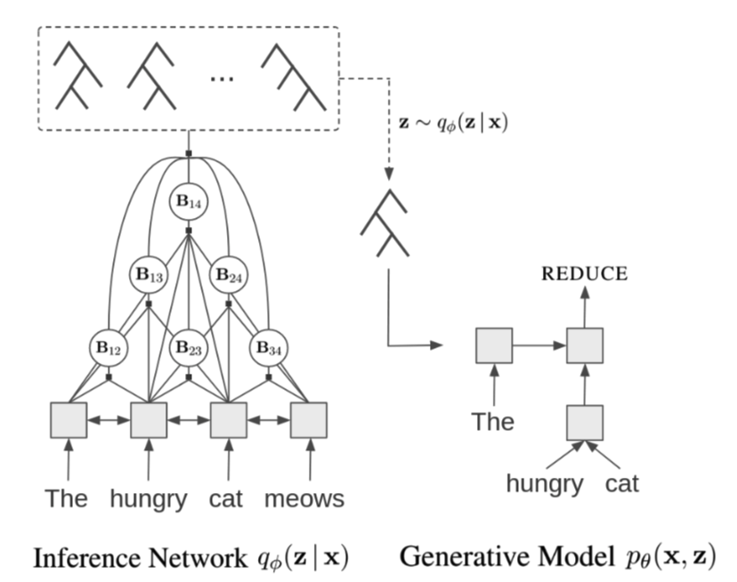
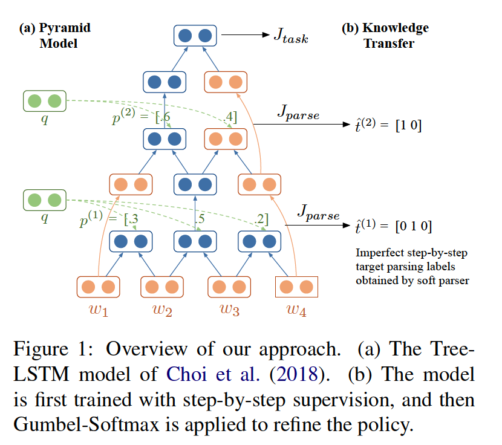

## Supervised Parser

&#x1F4D8; **Recurrent Neural Network Grammars, NAACL2016**

This paper proposes a RNNG model to learn the syntactic structure and a seuqence of word jointly, which is a top-down variant of transition-based parsing. This model has two variants, one is the parsing model, the other is the generation model.

From the high level viewpoint, the parsing model tries to model the probability distribution P(y | x), and the generation model tries to model P(y, x), where x is the word sequence and y is the syntax tree. This paper begains with some examples to demonstrate the process of the underline intuition of the two models and then it introduces how to use the stack LSTM to simulate the parsing process. One technique, importance sampling, used for inference may be helpful for solving the problem that how to compute the marginal probability p(x) when integrating through y is intractable.

Figures in the paper may help to understand the key ideas and details.

&#x1F4D8; **A Minimal Span-Based Neural Constituency Parser, ACL2017**

Different from the transition-based parser, this paper proposes to learn a span-based parser. This model leverages neural networks to model the label and span split of a parse. Based on the label score and split score, it uses two method to construct a parse: the chart parsing and top-down parsing.

The chart parsing is in the bottom-up fashion, which calculates the score of each span and using the dynamic programming algorithm to find the best tree. In contrast, the top-down method greedily split the span from a high level.

## Unsupervised Methods

&#x1F4D8; **Unsupervised Recurrent Neural Network Grammars, NAACL2019**

To move the RNNG into the unsupervised grammar induction scenario, this paper proposes to use a inference network to approximate the distribution P(z|x), which plays the similar role of the Stack LSTM based transition parser.

Similar to RNNG, this work defines a joint probability distribution p(x, z), where x is the terminal input sequence of length T, and z is a binary vector of length 2T-1 (Catlan Number). The framework is shown in the figure below:

For the genrative model, using the stack representation at timestep t, the URRN model first samples an action: SHIFT (z_t = 0, generate a terminal symbol) and REDUCE (z_t = 1, pop the last two elements on the stack and push the merged state back). For the inference network, it uses a neural CRF parser to model the posterior q(z|x).

&#x1F4D8; **An Imitation Learning Approach to Unsupervised Parsing, ACL2019**

This paper proposes a immitation learning framework. The model warms up by using a Tree-LSTM model with discrete parsing operations to learn the continuous PRPN. After the knowledge distillation phase, it turns to improve its policy based on a semantically oriented task.

&#x1F4D8; **Compound Probabilistic Context-Free Grammars for Grammar Induction, ACL2019**

Traditional PCFG models are count-based, however, there is a long history of work showing that it is difficult to learn meaningful grammars from natural language data. In contrast, this paper parameters the PCFG's rule probability with neural networks, which makes it possible to induce linguitically meaningful grammars, and uses a compound PCFGs that assume a prior on sentence-level rule probabilities.

&#x1F4D8; **A Critical Analysis of Biased Parsers in Unsupervised Parsing, arxiv1909**

(Give a shot brief of ONLSTM before the talk)

This paper is first-authored by Cris Dyer, which challenges the validation of ONLSTM. It questions the design of ONLSTM model and the parsing algorithm of ONLSTM. Firstly, when using the forget gate of the conventional LSTM and the parsing algorithm of ONLSTM, it achievies comparable results of ONLSTM. Secondly, this paper finds the parsing algorithm that spliting by individual word has a bias to R-Branching.

&#x1F4D8;  **PaLM: A Hybrid Parser and Language Model, EMNLP2019**

This paper adds a attention layer upon the AWD-LSTM model, which will be used to learn a constituency tree. This paper provides an effective method to model the biredctional representation of a span [i, j], namely the [h_{[i:j]}^f, h_{[i:j]}^b]. Based on the attention score, the paper can use the CKY method to build a consituency parsing tree.

The model of this paper has two variants, one is totally unsupervised and the other adds an additional loss obtained from the supervised binary tree vector.

<!-- **Neural Unsupervised Parsing Beyond English, EMNLP2019** -->