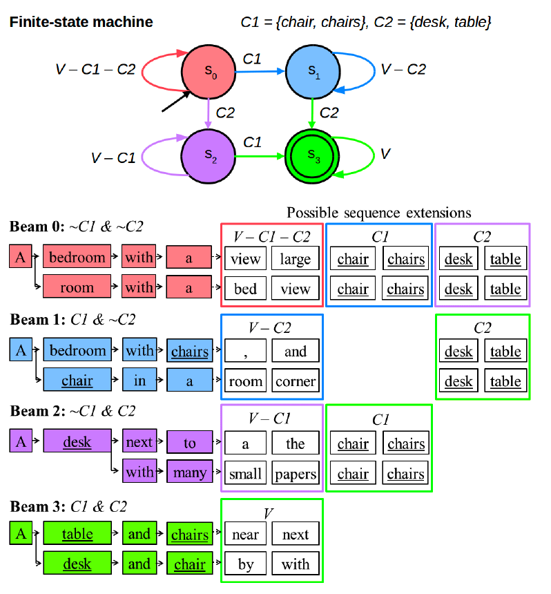
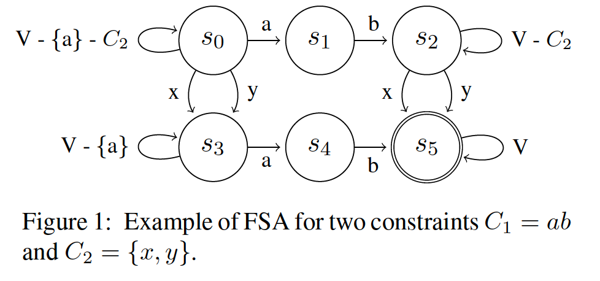
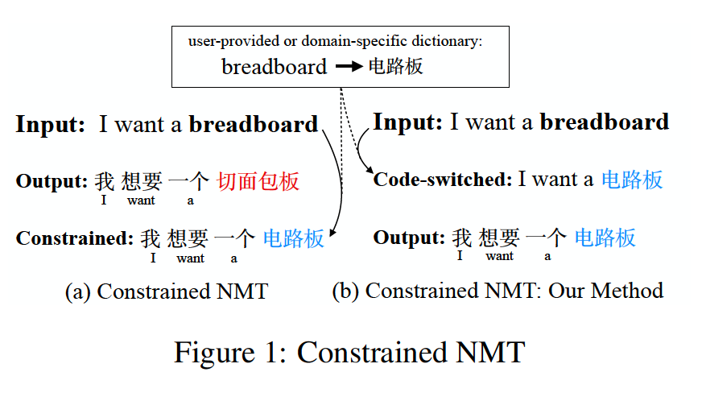

# CAT

## Input Method

&#x1F4D8; **Input Method for Human Translators: A Novel Approach to Integrate Machine Translation Effectively and Imperceptibly, TALLIP2018**

+ Problem
  1. Current phrase generation
  2. Next phrase prediction
+ Solution
  1. To predict the phrase `h_1^n` given the segmented pinyin `y_1^n`, this paper uses a linear model to score the convertion. Besides the general features used for input method, this paper also introduces three kinds of features that related to the translation rules, hypotheses, and n-best list.
  2. 

&#x1F4D8; **Moon IME: Neural-based Chinese Pinyin Aided Input Method with Customizable Association, ACL2018**

+ Problem
  + Previous solutions to pinyin IME is quite simple...
+ Solution:
  + train a pinyin to Chinese NMT model
  + introduce an IR system for association

## Interactive Machine Translation

&#x1F4D8; **PRIMT: A Pick-Revise Framework for Interactive Machine Translation, NAACL2016**

+ Problem
  + Traditional IMT that interacts with human in a LTR order, which is onerous and cannot modify the critical errors at the end of the sentence.
+ Solution:
  + Pick a crucial error. A classification model is used to find the phrases that will lead to a BLEU improvement greater than a threshold after revision.
  + Revise the error. Using a classification model to automatically give the correction.

&#x1F4D8; **Active learning for interactive neural machine translation of data streams, CoNLL2018**

+ Problem
  + Give an set of source sentences `V`, how to select a subset `V_s`, which will be translated with an IMT system and then used to finetune the MT model. 
+ Solution
  + This paper proposed several sampling methods: QE sampling, coverage sampling, attention distraction sampling, and the ensemble of previuos methods.

&#x1F4D8; **Correct-and-Memorize: Learning to Translate from Interactive Revisions, IJCAI2019**

+ Problem
  + Not all translation errors are equally crucial
  + Some translation errors occur repeatedly
+ Solution
  + Pick and Revise.
    + Use the baseline model to get the hypotheses `{y_1, ..., y_j, ..., y_n}`.
    + Pick a word `y_j` and replace it with `y_j^r`.
    + Use a forward NMT model to regenerate the right part of `{y_j^{\prime}, ..., y_n^{\prime}}` given `{y_1, ..., y_j^r}`
    + Use a backward NMT model to regenerate the left part `{y_1^{\prime}, ..., y_{j-1}^{\prime}}` given `{y_j^{\prime}, ..., y_n^{\prime}}`
  + This paper uses a key-value memory `(<s, c>, y^r)` to remember the revision history. It also use the sentences adjacent to the testing sentence to finetune the model.

## Lexicallly Constrained Decoding

>I assume most people are familiar with the GBS and DBA algorithms below.

&#x1F4D8; **Lexically Constrained Decoding for Sequence Generation Using Grid Beam Search, ACL2017**

&#x1F4D8; **Fast Lexically Constrained Decoding with Dynamic Beam Allocation for Neural Machine Translation, NAACL2018**

## Finite-state Machine Based Decoing

&#x1F4D8; **Guided Open Vocabulary Image Captioning with Constrained Beam Search, EMNLP2017**

+ Problem
  + image captioning models do not generalize well to out-of-domain images containing novel scenes or objects.
+ Solution
  + finte-state machine based beam search

&#x1F4D8; **Neural Machine Translation Decoding with Terminology Constraints, NAACL2018**

+ Problem
  + Integrating user-provided terminology constraints to translation results
+ Solution
  + Bring the Finite-state Machine Based Decoing to NMT
    + Take phrase constraints into consideration instead of separate words only.
    + Multi-Stack Decoding: maintain a beam for each state.
    + Decoding with Attention: the transition condition is change to whether the model attends to an interval around the corresponding source terminology. 

## Backward and Forward Language Modeling

&#x1F4D8; **Backward and Forward Language Modeling for Constrained Sentence Generation, arXiv2015**

+ Problem
  + Impose hard constraints to the generated text on the LM task.
+ Solution
  + B/F Language Model
    + syn-B/F 
    + asyn-B/F 

&#x1F4D8; **BFGAN: Backward and Forward Generative Adversarial Networks for Lexically Constrained Sentence Generation, TASLP2019**

+ Problem
  + Mou et al., 2015 tends to generate semantically inconsistent or incoherent sentences
+ Solution
  + Propose a BFGAN model, which has a backward generator, a forward generator, and a discriminator.

&#x1F4D8; **Correct-and-Memorize: Learning to Translate from Interactive Revisions, IJCAI2019**

*(see the notes of this paper in the survey of IMT)*

## Data Augmentation Based Constrained Generation

> The three works below are trying to integrate bilingual terminologies through data augmentation.

&#x1F4D8; **Code-Switching for Enhancing NMT with Pre-Specified Translation, NAACL2019**

+ Solution
  + Replace the source terminology with its translation and use a pointer net to learn the copy mechanism.

&#x1F4D8; **Training Neural Machine Translation to Apply Terminology Constraints, ACL2019**

+ Solution
  + This paper propose two kinds data augmentation strategies, one is replacing and the other is appending. It uses three types of embedding to make the NMT model can distinguish different kinds of words in the source side.

&#x1F4D8; **Merging External Bilingual Pairs into Neural Machine Translation, arXiv2019**

+ Solution
  + This paper propose three kinds of tagging methods:
    + "我 爱 \<start> 香港 <end>  |||  i love \<start> hong kong \<end>"
    + "我 爱 \<start> 香港 \<middle> hong kong <end>  |||  i love \<start> hong kong \<end>"
    + Add different types of emebdding on previous two methods.

## Other Works

<!-- &#x1F4D8; **Neural Post-Editing Based on Quality Estimation, WMT2017**
 -->

&#x1F4D8; **An Exploration of Placeholding in Neural Machine Translation, MTSummit2019**

+ Question
  + Is replacing the NER or NUM, EMAIL... to placeholder tags a really good idea?
+ Solution
  + This paper explored several placeholding techniques:
    + Replace source tokens with tag + index, e.g., EMAIL1
    + Without indexing, the bipartite matching algorithm can be used to align the tag in a source sentence with the tag in a target sentence.
    + External alignment weights, e.g., attention scores, fast-align
  + The ansewer is not clear-cut
    + Baseline model does a decent job of translating many of these types.
    + Some of the items being masked cannot be perfectly predict. For example, "It's NUMBER" -> "It's NUMBER pm", where NUMBER is a mask for 14:00 
    + Unindexed masking can do a good job of passing items through, compared to indexing system. In situations where it is better to drop the identified term than to mistranslate it, unindexed masking may be preferable.

&#x1F4D8; **CGMH: Constrained Sentence Generation by Metropolis-Hastings Sampling, AAAI2019**

+ Solution
  + Using M-H sampling to sample instances from the distribution that some specific keywords are in the language.

