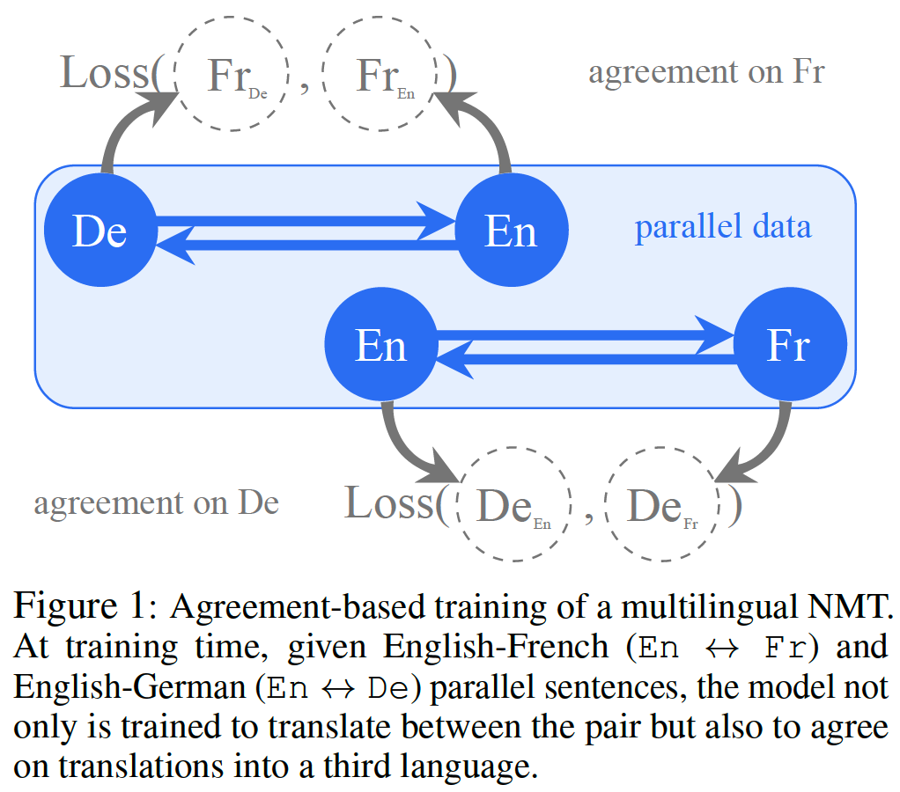

## Neural Machine Translation

&#x1F4D8; **Consistency by Agreement in Zero-shot Neural Machine Translation**

&#x1F4A1; **keywords**: low-resource&nbsp;&nbsp;&nbsp;&nbsp;zero-shot

This paper introduce a consistent agreement-based training method to improve the translation quality.

It is worth to read the theory part of this paper.

&#x1F4D8; **ReWE: Regressing Word Embeddings for Regularization of Neural Machine Translation Systems**

&#x1F4A1; **keywords**: embedding&nbsp;&nbsp;&nbsp;&nbsp;regularization

The paper propose to regularize NMT system by adding a word embedding prediction loss to the training objective. And this technique is only leveraged during training, leaving the inference procedure unchanged.

Besides the *exposure bias* problem that are more frequently mentioned, this paper also introduces another problem of NMT:

> It treats all the predictions other than the ground truth as equally incorrect. As a consequence, synonyms and semantically-similar words — which are often regarded as highly interchangeable with the ground truth — are completely ignored during training.

&#x1F4D8; **Lost in Machine Translation: A Method to Reduce Meaning Loss**

&#x1F4A1; **keywords**: fidelity

This paper foucs on the *Many-to-One* problem, which in many cases results in important distinctions in meaning being lost in translation. For example, both the sentences "I cut my finger" and "I cut my finger off" are translated to the same French sentence "Je me suis coupe le doigt", which is ambiguous as to whether the finger is detached. Then they use Rational Speech Acts to define a translator which reduces many-to-one mappings and consequently meaning loss.

The structue of this paper is a little wired, e.g., the first section name is not "Introduction" but "Many-to-One Translations".

&#x1F4D8; **Code-Switching for Enhancing NMT with Pre-Specified Translation**

&#x1F4A1; **keywords**: lexically constrained decoding

This paper propose a method to integrate the terminology by data augmentation. The case below explains all:

> Input:  I want a breadboard\
> Code-switched: I want a 电路板\
> Output: 我 想要 一个 电路板

where "电路板" is the given translation of the terminology "breadboard".

There is a drawback that, this methods need the expert to provide more information than the lexically constrained decoding method. Concretely, the experts have to explicitly tell the NMT system which words in the source side should be translated to the target. However, the GBS method only needs the experts to specify whether the translation of a terminology should appear in the target side.

&#x1F4D8; **Competence-based Curriculum Learning for Neural Machine Translation**

&#x1F4A1; **keywords**: curriculum learning

The motivation of curriculum learning is that, training algorithms can perform better if training data is fed in a specific order, starting from *easy* examples and moving on to more *difficult* ones, as the learner becomes more competent. Following the motivation, this paper propose a unified framework, which introduce a difficulty metric and a *competent function*. The difficulty metric is defined to score the difficult levels of training examples, and the training data will be sorted according to this difficulty score. The competence function c(t) returns a value in [0, 1], which indicates that top c(t) portion of the training data can be used for training.

&#x1F4D8; **Extract and Edit: An Alternative to Back-Translation for Unsupervised Neural Machine Translation**

&#x1F4A1; **keywords**: unsupervised nmt&nbsp;&nbsp;&nbsp;&nbsp;retrieval

This paper proposes an alternative method to back-translation for unsupervised neural machine translation, which is retrieval based. Different from back-translation that use reconstruction loss to measure the translation error, the retrieval based method measures the translation error by calclulating the distance between translated sentence and the top-k retrivaled sentence.

## Language Model

&#x1F4D8; **The Emergence of Number and Syntax Units in LSTM Language Models**

&#x1F4A1; **keywords**: syntax&nbsp;&nbsp;&nbsp;&nbsp;explanation

This paper takes a approach inspired by neuroscience to answer the question that whether the language model (LSTM) has captured the *genuine structure properties*, which is complementary to the way of probing. The question mentioned above is non-trivial, because the success on probing of representations encoded by LSTM may be explained by opportunistic surface-pattern-based heuristics. For example, in the number agreement task ("the **boy** near the *cars* **greets**..."), the verb form can be easily predicted by percolating the number of the first noun in the sentence, no matter how many intervening nouns are used to separate the subject and main verb. from the viewpoint of neuroscience, this paper finds that two "grand-mother" cells are specialized to carry number features from the subject to the main verb across the intervning material, which are noly crutial for long-distance cases. When the subject and the verb are close, there is a distributed machanism to predict the number. They also identify a set of cells tracking syntactic structue. Different the behavioural evidence (probing task), this paper provide direct evidence that LSTM learns the genuine structure properties.

&#x1F4D8; **Neural Language Models as Psycholinguistic Subjects: Representations of Syntactic State**

&#x1F4A1; **keywords**: syntax&nbsp;&nbsp;&nbsp;&nbsp;explanation&nbsp;&nbsp;&nbsp;&nbsp;constituent tree

Different from previous lingustic tasks that focus on relationships of *dependency*, this paper focuses on the whether NLM have learned *incremental syntactic state* representations. By examining LM behavior on artificially constructed sentences, which are designed to expose behavior that is crutial dependent on sytactic state representations, they find that all the leveraged models have encoded basic syntactic state information, but only the models trained on large-scale datasets are sensitive to subtle lexical cues signalling changes in syntactic stat.

Particularly, the construct sentences focus on complex subordinate clauses and *garden path effects*. The latter is fresh to me, so I also search some explanations of it. According to the [Wikipedia](https://en.wikipedia.org/wiki/Garden-path_sentence):

> A garden-path sentence is a grammatically correct sentence that starts in such a way that a reader's most likely interpretation will be incorrect; the reader is lured into a parse that turns out to be a dead end or yields a clearly unintended meaning.

To better understand its meaning, there is an example:

> The old man the boat.

## Translation of Word Embeddings

&#x1F4D8; **Aligning Vector-spaces with Noisy Supervised Lexicons**

&#x1F4A1; **keywords**: word translation

A popular setting of word translation is that, given two sets of word vectors and the lexicon mapping between this two sets, it will learn a word translation model in a supervised fashion, and test the model on unseen word vectors. This paper take the noises in lexicon mapping into consider.